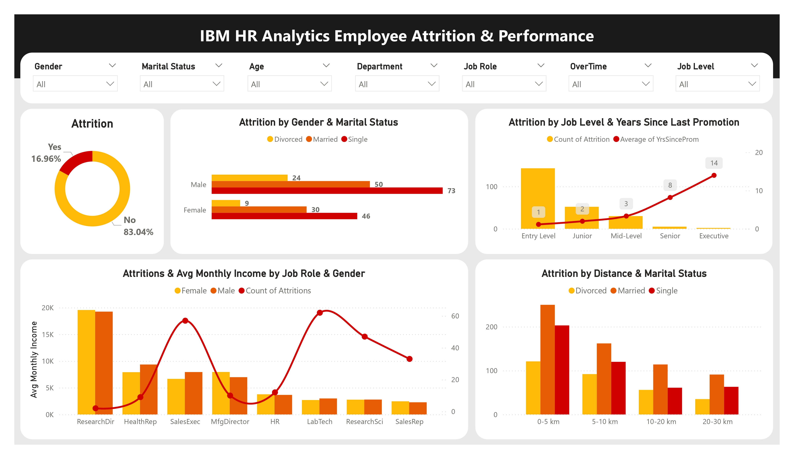

# 📊 IBM HR Analytics: Employee Attrition & Performance

This project presents a clear analysis of employee attrition patterns using IBM’s fictional HR dataset. By leveraging Python for data cleaning, exploration, and visualization, it identifies the key factors that contribute to turnover — helping HR professionals understand where to focus retention efforts.

---

## 📌 Project Highlights

- Analyzed factors influencing why employees leave or stay.
- Profiled employees with higher attrition risk based on demographics and job-related features.
- Visualized attrition rates by department, job role, and overtime.
- Explored the impact of distance from home, satisfaction levels, and performance ratings.
- Used clear heatmaps, crosstabs, and plots to uncover hidden patterns.

---

## 🗂️ Dataset

- **Source:** Kaggle ([synthetic HR dataset for demonstration](https://www.kaggle.com/datasets/pavansubhasht/ibm-hr-analytics-attrition-dataset/data))
- **+35** Columns 

---

## 🛠️ Tools & Technologies

- **Python:** Pandas, Matplotlib, Seaborn
- **Power BI:** Interactive dashboard visualizations
- **Jupyter Notebook:** Data exploration and cleaning

---

## 📌 Key Insights

- Employees working overtime with low job satisfaction are more likely to leave.
- Certain departments and job roles show higher turnover rates.
- Longer distances from home can increase attrition risk.
- Some performance and satisfaction factors strongly correlate with attrition trends.

---

## 📸 Dashboard Preview

---

## 🚀 How to Use

1. Clone this repository.
2. Open the Jupyter notebook to view the data analysis.
3. Explore the Power BI .pbix file for interactive insights.

---

## 📬 Contact

Open to feedback, suggestions, or collaboration!  
Feel free to **fork** this repo or connect with me on [LinkedIn](https://www.linkedin.com/in/reham-mahmoud-rushdi/).

---

## ⚠️ Disclaimer

This project uses a **fictional dataset** created by IBM for educational purposes only.
